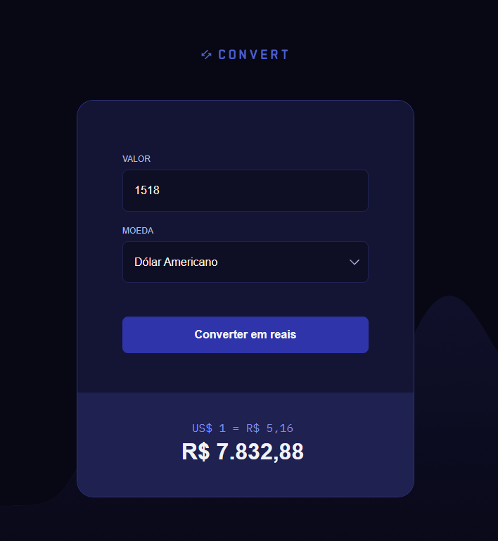

<h1 align="center"> Conversor de Moedas </h1>

Este projeto foi desenvolvido como parte de um exercício prático para treinar conceitos básicos de JavaScript. A proposta foi criar uma interface funcional de conversão de moeda, aplicando lógica simples e manipulação de DOM para tornar a experiência interativa e intuitiva. 

 O desafio consistiu em implementar as seguintes funcionalidades:  

- 🔢 Validação de entrada: o campo de valor aceita apenas números, evitando erros na conversão.  

- 💵 Cotação fixa: foi utilizada uma taxa de câmbio estática para simular a conversão de Dólar Americano (USD), Euro (€) e Libera Esterlina (£) para Real Brasileiro (BRL).  

- 🔄 Conversão de moeda: cálculo automático do valor convertido com base na cotação definida.  

- 🇧🇷 Formatação brasileira: o resultado é exibido no formato monetário brasileiro (R$), com separadores e casas decimais corretas.  

- 👁️ Exibir/ocultar resultado: o resultado da equação fica escondido aguardando o "submit" do usuário.  

🛠️ Tecnologias Utilizadas
- HTML
- CSS
- JavaScript (vanilla)

  

## 🚀 Tecnologias

Esse projeto foi desenvolvido com as seguintes tecnologias:

- HTML e CSS
- JavaScript

- [Acesse o projeto finalizado online!](https://vhbiten.github.io/ProjectStudy_Convert_CurrencyConverter/)
